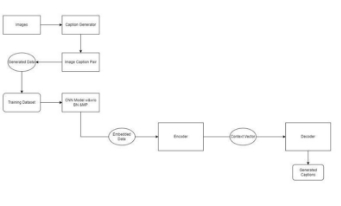
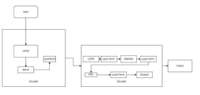
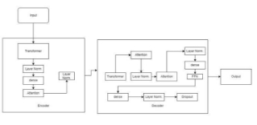
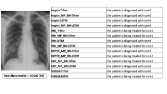
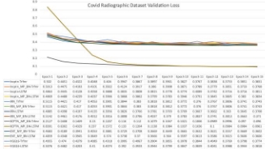
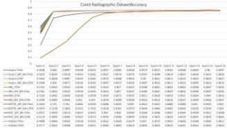

Encoder Decoder based Chess Disease Identification Model using Xray Radiological Images 

1st Thomas Abraham J. V. 

School of Computer Science and Engineering, Vellore Institute of Technology, Chennai Campus, Chennai, India, 600127 [thomasabraham.jv@vit.ac.in ](mailto:thomasabraham.jv@vit.ac.in)

2nd  Subhrato Som 

School of Computer Science and Engineering, Vellore Institute of Technology, Chennai Campus, Chennai, India, 600127 

[subhrato.som2019@vitstudent.ac.in ](mailto:subhrato.som2019@vitstudent.ac.in)

***Abstract*—**

**Purpose:** Generating Captions Label and Identifying objects for  deep  learning  models,  some  of  the  workload  of  these an image is one of the state-of-the-art problem statements. It can  professionals can be reduced. As we are able to design models be used in the field of Radiology as it can reduce the need for  that  can  identify  disease  and  then  generate  a  text-based manual  analysis  by  radiologists  and  provide  patients  with  a  description of the provided radiological images. These models human  like  experience.  In  recent  time  we  had  already  seen  can use neural networks to learn from the large-scale dataset increase  in  level  of  work-related  stress  among  doctors  and  which  can  help  them  to  further  enhance  the  process  of radiologists,  automated caption  generation can  help  with  that  identifying the cause and generate the description.  

also.  According to a study done by Elshami et.al [29] During the **Method:** In this research, we have used an Encoder-Decoder  time when COVID-19 was at its peak, the workload of Doctors based model for identifying disease with multiple CNN models  as  well  as  radiologists  increased  which  caused  work-related for feature extraction of the image data then encoder is used to  stress to be increased by 42.9% with fear score and anxiety also the  generate  context  vectors  and  then  the  decoder  generates  increased  during  that  period.  As  said  earlier,  using  a  deep captions from the context vector. After training all the models  learning-based  model,  which  can  provide  general  purpose we  have  compared  them.  In  this  research,  we  have  used  image captioning and enhance it to help us identify disease and radiological  dataset  for  training,  we  have  used  COVID  generate  descriptions  unique  to  patients,  we  can  reduce  the Radiographic Dataset from Kaggle.  workload of the radiologist [1]  and can save their time too **Result:** The first result which we found is that Xception based  which they can use to provide to some other important things. model produces better validation loss, Validation loss is a metric  These  models  can  also  help  improve  the  fluidity  of  the used to evaluate the generalization ability of a machine learning  diagnosis as well as it can provide human-like descriptions and model and the second result is that Inception-resnet-v2 based  can  provide  patient-friendly  experiences  as  they  can  provide models  provided  better  accuracy,  with  Inception-Resnet-v2- descriptions or captions for Xray Images that can be understood LSTM model producing best max accuracy.  by anybody. Also with certain amount of high training of the **Conclusion:**  This  study  provided  a  comparison  of  multiple  model, we can provide high accuracy results. 

image captioning models. Our models are capable of predicting  Describing Image or Image Captioning is one of the state-of- good  quality  captions  for  both  of  the  dataset.  With  more  the-art research that can not only be used in radiological data training, it may be possible to provide more better outcome with  but  also  can  be  multi-domain,  like  providing  autonomous respect to Chest X-ray dataset, improving the quantity of the  understanding for visually impaired people; it has several other image in each class can provide more better outcomes.  major roles in image-based search in browsers and e-commerce 

***Index  Terms*— Radiology,  Image  Captioning,  Convolutional**  websites.  Several  recent  studies  are  being  done  in  this  field **Neural Networks (CNN), Encoder-Decoder.**  which lured the interest of researchers in the field of Computer Vision and Natural Language Processing. Some studies even 

have implemented pre-trained language models like GPT [2] 

1. INTRODUCTION  and BERT.  

Radiological images like Chest X-ray images can be used and  The use of Encoder-Decoder-based model is one of the more are used for detecting a lot of diseases including diseases like  successful  ones  and  are  used  more  often  in  these  kinds  of COVID-19, Pneumonia, Lung Opacity, and a lot more other  research. For this research we have also opted to use encoder disease. Yao, L. [28] classified more diseases with chest X-ray  decoder  based  model.  In  this  model  we  have  used,  the images like Atelectasis, Cardiomegaly, Pneumothorax and etc.  Convolutional Neural Networks (CNNs) as pre-encoder, which Traditionally it has been the job of a Radiologist to do the  is used to extract image features which then encoder used to diagnosis of the Xray Images and predict the abnormalities but  generate context to be provided to the decoder, the decoder then with the advancement in the technology and the emergence of   uses  the  power  of  Natural  Language  Processing  to  generate 

appropriate description for the image. These models with some 

variations  are  often  used  in  studies  in  various  fields  for generating  good-quality  captions.  Transfer  Learning,  that entails  applying  knowledge  obtained  from  one  problem  to 

improve performance on a separate but related problem, has X-ray images are combined into one embedding space so they also played a vital role in the advancement of these kinds of can be compared and matched. Using the embeddings produced models as we can now use CNN models like Xception [30], by TieNet, DCRNet is then used to carry out the real disease Efficientnet  [33]  and  etc,  which  has  pre-trained  weights, classification and reporting. Their model found an 6% increase in trained on ImageNet dataset and can then be used to train on AUC.   

much  smaller  sized  custom  dataset  as  per  the  required In [9] proposed using an image captioning system where they application. We also have leveraged the usefulness of transfer combined convolutional neural networks (CNNs) and long short- learning  in  our  encoder  decoder  model  as  we  have  used term  memory  (LSTM)  networks  as  encoder  and  decoder  in pretrained CNN based image classification model for training.  MSCOCO dataset for generating captions with their 4000 entries Through this paper, we aimed to provide a comparative study being split using the 80:20 rule. The CNN model they used was of  multiple  encoder-decoder-based  models  and  to  find  the Inception-V3.  Zeng  et  al.  [10]  conducted  their  research  for better one out of it using the inspired by De Falco, I. et. al. ultrasound images where they con-struct an ultrasound images [23] where they classified COVID 19, we have used COVID- dataset from scratch. The dataset consists of 3 kinds of organs, 11 19 Radiographic Dataset[22] from Kaggle which is also the categories of diseases, ground-truth annotation texts, and ground- winner  of  the  COVID-19  Dataset  Award  by  Kaggle truth boxes of focus areas in ultrasound images. They proposed Community.  Which  consist  of  classes:  COVID-19,  Viral Faster RCNN VGG16 object detection. After object detection, Pneumonia, Lung Opacity, and Normal Lungs. In the dataset the  Regional  Proposal  Network  (RPN)  generates  region we have implemented multiple encoder decoder based models proposals,  and  RoI  Pooling  changes  the  arbitrary-size  feature and compared their accuracy scores, validation loss. The CNN maps of the region proposals to the set size. with LSTM as a based image classification models used for feature extraction language  generation  model.  They  compared  their  results  with of  the  Chest  Xray  image  data  used  in  this  research  are multiple  matrices  including  BLEU  and  METEOR  with  their Xception  [30],  Inception-V3  [31],  VGG16  [32],  Inception- proposed  method  performing  1%  better  scores  in  BLEU-1, Resnet-V2  [34],  and  EfficientNetB7  [33].  And  Long  Short BLEU-2.  Term Memory (LSTM) [35] and Transformers [36] are used In [6] Singh et.al perform research on the IU Chest X-ray dataset for encoding the embedded data from CNN model to context where they have used Convolution Neural Network as encoder vector  and  then  decoding  the  following  context  vectors  to and  LSTM  as  decoder.  Kisilev  et  al.  [7]  suggest  generating identify disease out of those 4 classes and providing unique reports from breast scan pictures. They offer a two-step strategy descriptions for them.  that  begins  with  detection  and  ends  with  description.  The identification process identifies candidates for Regions of Interest 

2. Literature Survey by beincg alcaulleagiting timthatee  bounding lesion. Finboxeding saasnd et thofeselimkealinthood ic deoscfrthipetoRrsOisI

WaImnd itah geNmsLorPin, e [mr1]eorseYea racsng h tuhady et ppaaerl.eni's, ng beitinwmg iteh donentrioesnspeinctht etoCheneimset ad geRofaddierolsecducogiribinincag g l paceonsxart midofine erthd ed:ef  ordeforsemcar, ciph boundation semsatantry, geic. adendThescdey ripnstotoitok ry,  wathnd hireceh 3 dcseimastecrplgoripiftoieiersss  ataherree wprknowleoroposkloaedged d  neofforw  raraedipprporoloaogit cgesh tsnebyraa nd ticon. omimbiTprhenioveng y prgeopospanetireeantlusacnd inag res. gepeTnecheifraiy cl prcsigonsocnieisfsictesancbutnty. Blyreoutasulbapetsr  reinft.oral mshor[e8]d t aSlsphrAo &aussTee sd athInd Uat cothearheest raXws-ktraawtey a rdad oftaandsthet,elaaand crk t medical  knowledge  such  as  effusion  lo-cated  at  pleural  and models by performing their experiments. 

atelectasis can help generate a more accurate report with CNN 

and NLP based model and found their model perform higher in  III. Method

BLEU 3/4 and an increase of 37.5% on Precision, 27.5% on 

Recall,  and  34.4%  on  F1-Score.  In  [2]  Selivanov  et  al.'s  *A.  Overview* 

proposed finetuning captions by using GPT for medical image  Our method includes a comparative study of multiple encoder- captioning.  The  suggested  method  is  evaluated  in  the  paper  decoder based Image Captioning models. Inspired by the image using both the new dataset and an existing dataset of naturally  captioning  model  by  keras  team  which  involves  a occurring  images  with  captions.  The  mode  is  found  to  be  Convolutional Neural Network (CNN) which extracts features outperforming other similar models. In [3] Lee et al. conducted  from the image and embeds the image which is then passed to their research in 2 dataset IU X-ray and Chest X-ray14 with  the encoder to generate the contex vector then it gets decoded to their  new  encoder-decoder  based  model  which  uses  Global- generate  captions.  For  training  the  model  we  have  used Local Visual Extractor (GLVE) to capture both global features  COVID-19  Radiography  Database  [22].  After  training  we and  local  features  and  Cross  Encoder-Decoder  Transformer  evaluated the models. 

(CEDT). GLVE is used here to extract global feature and local 

feature  by  cropping  the  image  as  per  requirements  and  their 

model  gave  better  performance  than  the  baseline  results,  by 

5\.6% in BLEU score, by 0.56% in METEOR, and by 1.98% in  *B.  Image Captioning* 

ROUGE-L.  Shin  et  al.'s  [5]  proposed  using  region  proposal  We  have  trained  the  image  captioning  model  to  perform  a network,  RNN,  and  classification  network.  region  proposal  comparative  study.  The  general  structure  of  the  captioning network to create region of interest which to be fed to RNN and  model is described in Fig(1). 

which finally is given to classification algorithm. Wang et al. 

proposed their model to be able to classify thorax disease from 

Chest  X-rays.  they  suggested  using  Text-Image  Embedding 

NETwork  (TieNet)  and  Disease  Classification  and  Reporting 

NETwork (DCRNet). Using TieNet, radiology records and chest 

**Fig. 2** LSTM based Encoder and Decoder. 

**Fig.  1.**  Block  Diagram  of  Image  Captioning  model  for  Covid  Radiographic  Dataset.  

To do this study we have taken 12,000 sets of sample images  

paired with their respective disease description from the Covid  

Radiographic  Dataset  [22]  and  divided  them  using  the  80:20  

rule, inspired by [7] Puscasiu et. al. As there was no disease  

description  included  with  the  dataset.  So,  we  had  provided  

captions for all the images with respect to the class it belongs to.  

For training our model in broader vocabulary, we have provided  

15 captions for each of the abnormality and divided it using the  

random function to the model in the image.  **Fig. 3** Transformer based Encoder and Decoder. 

The decoder then takes the input which it then uses to generate  In this research, we have used multiple Convolutional Neural captions. The casual attention mask is used to stop the decoder Networks  (CNNs)  based  imager  classification  models  for from paying attention to upcoming time steps while it is being extracting the features or we can say embedding the images, trained. The mask is a lower triangular matrix with a (i,j) member which  includes  Inception-v3  [31],  Inception-v3  with  Batch that is either 0 or 1 depending on whether j > i. We have trained Normalizations  and  Max  Pooling,  Inception-ResNet-v2  [34], the model in 2 runs first for 10 epochs to calculate the accuracy Inception-ResNet-v2  with  Batch  Normalizations  and  Max and validation loss and for evaluating output in the evaluation Pooling, VGG16 [32], Xception [30] with Batch Normalizations matrix  i.e.  BLEU  and  RougeL,  etc,  5  epochs.  In  the  training and  Max  Pooling  and  EfficientNetB7  [33]  with  Batch model, there is also an early stopping callback with a patience of Normalizations  and  Max  Pooling.  Batch  Normalizations  are 3 [37].  Fig (4) shows an example of output generated by one the generally  used  to  increase  training  stability  and  make  the implemented model. 

learning  process  quicker.  The  training  process  is  made  more  

stable  and  effective  by  normalizing  the  activations  of  the 

neurons in each stratum of the network and it also prevents the 

model from overfitting. Also, we have added max pooling to the 

models which are used to add spatial variance to the model that 

helps  the  network  to  become  tolerant  to  minor  rotations  or 

translations in the source picture. The model performs feature 

extraction as discussed using the CNN from the given training 

set and helps in embedding the image. Feature extraction is a 

method that extracts useful and meaningful information  from 

raw  data  to  create  a  more  compact  representation,  in  the 

embedded form of a feature vector. It entails converting input  **Fig.  4**  Example  output  description  generated  by  Inception-Resnet-v2  and data  into  a  set  of  numerical  features  that  capture  the  transformer with batch normalization and max pooling. 

fundamental traits or patterns necessary for a certain activity. 

The  embedded  data  extracted  from  feature  extraction  is  then  *C.  Dataset Used* 

then passed to transformers [35] and LSTM [36] based encoders  For  image  captioning  in  Chest  Xray  images,  we  have  used individually  that  is  having  a  dense  sub-layer  and  uses  COVID-19  Radiography  Database  [22]  which  is  also  the sequence2sequence learning to generate the context vector for  winner  of  the  COVID-19  Dataset  Award  by  Kaggle the decoder. The context vector i.e. the output from the encoder  Community  it  was  developed  by  researchers  from  Qatar along with a sequence of  provided description for an image is  University,  Doha,  Qatar,  and  the  University  of  Dhaka, then  fed  to  the  decoder  respective  to  the  encoder  i.e.,  If  the  Bangladesh  and  it  consists  of  images  under  the  category  of ebencLodeSTrMis ausnd inifg thLeS TencM odearcrhiistechatuvireng thTen rathnsefordemceoder arrcwhiiltelcatulsro e COVID-19  positive,  Lung  Opacity  i.e.,  Non-COVID  Lung 

then the decoder will also be Transformer based as shown in Fig  Infection, Viral Pneumonia, and Normal Lungs. The diagnoses 

(2) and Fig (3).  for  the  images  were  then  graded  by  two  expert  physicians before  being  cleared  for  training  in  the  AI  system.  As  the 

dataset did not have captions for the images, we had created 

our  own  caption  dataset  for  all  the  images  present  in  the 

following dataset and then used them for training our image  IV.  Evaluation and Results 

captioning models.  In fig (5) the generated description with identified disease by all  12  models  have  been  shown.  All  the  encoder  decoder 

models are compared with real anomaly [38] has been shown. In the image all of our model seems to provide accurate output. 

4. *Convolutional Neural Network Model*  Comparing output of multiple models can also be useful as we The  CNN  model  used  for  the  study  are  VGG16  [32],  can also cross check them. 

Inception-v3  [31],  Inception-Resnet-v2  [34],  Xception 

[30], and EfficientNetB7 [33]. 

**VGG16:** The VGG16 architecture was introduced in 2014  and  has  16  convolutional  layers.  To  reduce  the  spatial  dimensions, the network employs max pooling layers and  3x3  convolutional  filters  throughout.  Although  VGG16  has a straightforward and basic architecture, it has more  parameters  than  all  image  classification  models  in  this  study. It requires the input shape of (224, 224, 3).  

**Inception-v3:**  The  Inception-v3  architecture  was  introduced in 2015, and was created to be more accurate  than Inception-v1 while using fewer processing resources.  Fig. 5 List of identified disease description generated by all of our model Factorized  7x7  convolutions  and  aggressive  spatial  compared to the abnormality [38]. 

pooling  are  used  in  Inception-v3,  which  minimizes  the  

calculation and parameter count. It requires an input shape  

of (299, 299, 3).  

**Inception-Resnet-v2:**  The  Inception-Resnet-v2  

architecture  was  released  in  2016,  and  combines  the  

Inception  design  with  residual  connections  to  create  

deeper  and  more  precise  networks.  It  requires an  input  

shape of (299, 299, 3).  Fig.  6  Min  validation  loss  and  max  accuracy  of  models  in  Covid 

Radiographic Database. 

**Xception:**  The  Xception  architecture  was  released  in 

2017\. Xception uses depth wise separable convolutions to  Shown in fig (6) is the min validation loss and max accuracy separate the spatial and channel dimensions in lieu of the  of  models  in  Covid  Radiographic  Database.  We  have standard convolutions to reduce parameters and improve  calculated validation loss and accuracy for the models which accuracy. It also requires an input shape of (299, 299, 3).  we ran for COVID-19 Radiographic dataset with the epoch set to  15.  From  fig  (10)  we  can  clearly  see  that,  of  all  trained model the model which provided the least minimum validation **EfficientNet:** The EfficientNet architecture was released  loss was Xception-Transformer with batch normalization and 

in  2019.  EfficientNet  uses  the  fewer  parameters  of  all  max  pooling,  with  a  validation  loss  score  of  0.096,  and image  classification  models  used  here  and  can  also  Inception-Resnet-v2-LSTM  based  model  with  batch provide improved accuracy.  normalization and max pooling provided highest accuracy for 

5. *LSTM and Transformers*  the dataset, with an accuracy of 0.86560. Fig (7) shows the line **LSTM:**  Long  Short-Term  Memory  (LSTM)  [36]  is  a  chart of validation loss and accuracy for all the implemented Recurrent  Neural  Network  based  architecture.  LSTMs  models from the first epoch to the last. 

uses gates to regulate the flow of information into and out 

of memory cells where they can store information about 

previous inputs that can be selectively updated. It was first 

introduced in 1997. 

**Transformers:** Transformers [35] were first introduced in 2017.  Transformers  capture  long-term  dependencies without directly maintaining a memory cell because they process  entire  sequences  at  once  using  self-attention mechanisms.  In  a  Transformer,  multiple  self-attention heads  process  the  input  sequence  in  parallel  while dynamically  weighing  the  relative  significance  of  the various segments of the sequence. 

 

Fig. 8 Line Chart of validation loss  and accuracy for all the implemented models from the first epoch to the last and their epoch value. 

Compared to other models discussed in literature survey in our dataset  compared  to  others  in  MIMIC  dataset,  our  model IRN\_MP\_BN-LSTM  out  of  all  the  models  outperformed  in other dataset. In table 1 shown accuracy and validation loss of all our models and in table 2 we compared the output accuracy of our model with reference models. 

||**Incp tn- Trf mr** |**Incptn\_M P\_BN- Trfmr** |**Incp tn- LST M** |**Incptn\_M P\_BN- LSTM** |**IRN\_T rfmr** |**IRN\_MP \_BN- Trfmr** |**IR N- LS TM**|**IRN\_MP \_BN- LSTM** |**XCPTN\_M P\_BN- Trfmr** |**XCPTN\_M P\_BN- LSTM** |**ENT\_MP \_BN- Trfmr** |**ENT\_MP \_BN- LSTM** |**VGG 16- Trfm r** |**VGG 16- LST M** |
| :- | :- | :- | :- | :- | :- | :- | :- | :- | :- | :- | :- | :- | :- | :- |
|Accur acy |0\.85 97 |0\.8626 |0\.86 37 |0\.8616 |0\.8592 |0\.8592 |0\.86 32 |0\.8647 |0\.853 |0\.854 |0\.8598 |0\.8644 |0\.861 1 |0\.863 2 |
|Val\_ Loss |0\.38 31 |0\.3768 |0\.38 11 |0\.3834 |0\.3743 |0\.3743 |0\.37 08 |0\.371 |0\.096 |0\.0961 |0\.3602 |0\.3606 |0\.377 4 |0\.381 8 |

Table 1 :- Accuracy and Validation loss of our models 

|**Model** |**Dataset** |**Accuracy** |
| - | - | - |
|S&T [29] |MIMIC-CXR |0\.423 |
|SA&T [30] |MIMIC-CXR |0\.703 |
|Tienet [31] |MIMIC-CXR |0\.741 |
|TopDown [32] |MIMIC-CXR |0\.743 |
|Yang et.al [1] |MIMIC-CXR |0\.816 |
|Selivanov et.al [2] |MIMIC-CXR |0\.861 |
|Ours(IRN\_MP\_BN- LSTM) |CRD |**0.864** |

Table 2:- Accuracy of our model compared with referenced models 

ACKNOWLEDGMENT 

**Funding** The study did not receive any funding. 

**Conflict  of  interest**  The  authors  declare  that  they  have  no conflict of interest.  

**Ethical approval** This article does not contain any studies with human participants or animals performed by any of the authors. 

**Informed Consent** This article does not contain patient data.  

**Data Source** The dataset used is an open-source data set from Kaggle https://www.kaggle.com/datasets/tawsifurrahman/covid19- radiography-database  and the Xray Image in Fig 9 was taken from  [https://www.itnonline.com/content/how-does-covid-19- appear-lungs.](https://www.itnonline.com/content/how-does-covid-19-appear-lungs) 

REFERENCS 

1. Yang, S., Wu, X., Ge, S., Zhou, S. K., & Xiao, L. (2022). Knowledge  matters:  Chest  radiology  report  generation  with general and specific knowledge. Medical Image Analysis, 80 , 102510. 
1. Selivanov, A., Rogov, O. Y., Chesakov, D., Shelmanov, A., Fedulova, I., & Dylov, D. V. (2023). Medical image captioning via generative pretrained transformers. Scientific Reports, 13 (1), 4171. 
1. Lee, H., Cho, H., Park, J., Chae, J., & Kim, J. (2022). Cross encoder-decoder  transformer  with  global-local  visual  extractor for medical image captioning. Sensors, 22 (4), 1429. 
1. Shin, H. C., Roberts, K., Lu, L., Demner-Fushman, D., Yao, J.,  &  Summers,  R. M.  (2016).  Learning  to  read  chest  x-rays: 

Recurrent  neural  cascade  model  for  automated  image International conference on machine learning (pp. 6105-6114). annotation. In Proceedings of the IEEE conference on computer PMLR. 

vision and pattern recognition(pp. 2497-2506).  [20] Szegedy, C., Ioffe, S., Vanhoucke, V., & Alemi, A. (2017, 

5. Wang,  X.,  Peng,  Y.,  Lu,  L.,  Lu,  Z.,  &  Summers,  R. M. February).  Inception-v4,  inception-resnet  and  the  impact  of (2018).  Tienet:  Text-image  embedding  network  for  common residual connections on learning. In Proceedings of the AAAI thorax disease classification and reporting in chest x-rays. In conference on artificial intelligence (Vol. 31, No. 1). Proceedings  of  the  IEEE  conference  on  computer  vision  and [21] Hochreiter, S., & Schmidhuber, J. (1997). Long Short-Term pattern recognition (pp. 9049-9058).  Memory.  Neural  Computation,  9  (8),  1735-1780. 
5. Singh, S., Karimi, S., Ho-Shon, K., & Hamey, L. (2019, https://doi.org/10.1162/neco.1997.9.8.1735. 

December).  From  chest  x-rays  to  radiology  reports:  a [22] Vaswani, A., Shazeer, N., Parmar, N., Uszkoreit, J., Jones, multimodal machine learning approach. In \*2019 Digital Image L., Gomez, A. N., ... & Polosukhin, I. (2017). Attention is all you Computing: Techniques and Applications (DICTA)\* (pp. 1-8). need. Advances in neural information processing systems, 30. IEEE.  [23]  Prechelt,  L.  (2012).  Early  stopping—but  when?.  Neural 

7. Allaouzi, I., Ben Ahmed, M., Benamrou, B., & Ouardouz, networks: tricks of the trade: second edition, 53-67. 

   1000. (2018, October). Automatic caption generation for medical [24] How Does COVID-19 Appear in the Lungs? (2021, October images. In \*Proceedings of the 3rd International Conference on 3).  Imaging  Technology  News. Smart City Applications\* (pp. 1-6).  https://www.itnonline.com/content/how-does-covid-19-appear- lungs 
7. Babar,  Z.,  van  Laarhoven,  T.,  &  Marchiori,  E.  (2021). [25] Vedantam, R., Lawrence Zitnick, C., & Parikh, D. (2015). Encoder-decoder models for chest X-ray report generation   Cider:  Consensus-based  image  description  evaluation.  In perform  no  better  than  unconditioned  baselines. \*Plos Proceedings  of  the  IEEE  conference  on  computer  vision  and one\*, \*16\*(11), e0259639.  pattern recognition (pp. 4566-4575). 
7. Puscasiu, A., Fanca, A., Gota, D. I., & Valean, H. (2020, [26] Wang, C. Y., Bochkovskiy, A., & Liao, H. Y. M. (2022). May). Automated image captioning. In 2020 IEEE International YOLOv7: Trainable bag-of-freebies sets new state-of-the-art for Conference  on  Automation,  Quality  and  Testing,  Robotics real-time object detectors. arXiv preprint arXiv:2207.02696. (AQTR) (pp. 1-6). IEEE.  [27] Ren, S., He, K., Girshick, R., & Sun, J. (2015). Faster r-cnn: 
7. Zeng, X., Wen, L., Liu, B., & Qi, X. (2020). Deep learning Towards  real-time  object  detection  with  region  proposal for  ultrasound  image  caption  generation  based  on  object networks. Advances in neural information processing systems, detection. Neurocomputing, 392, 132-141.  28. 
7. COVID-19  Radiography  Database.  (2022,  March  19). [28]  Ronneberger,  O.,  Fischer,  P.,  &  Brox,  T.  (2015).  U-net: Kaggle.  Convolutional networks for biomedical image segmentation. In https://www.kaggle.com/datasets/tawsifurrahman/covid19- Medical Image Computing and Computer-Assisted Intervention– radiography-database  MICCAI  2015:  18th  International  Conference,  Munich, 
7. De  Falco,  I.,  De  Pietro,  G.,  &  Sannino,  G.  (2022). Germany, October 5-9, 2015, Proceedings, Part III 18 (pp. 234- Classification of Covid-19 chest X-ray images by means of an 241). Springer International Publishing. interpretable  evolutionary  rule-based  approach.  Neural [29] Vinyals, O., Toshev, A., Bengio, S., & Erhan, D. (2015). Computing and Applications, 1-11.  Show and tell: A neural image caption generator. In Proceedings 
7. Hodosh,  M.,  Young,  P.,  &  Hockenmaier,  J.  (2013). of  the  IEEE  conference  on  computer  vision  and  pattern Framing image description as a ranking task: Data, models and recognition (pp. 3156-3164). evaluation metrics. Journal of Artificial Intelligence Research, [30]  Xu,  K.,  Ba,  J.,  Kiros,  R.,  Cho,  K.,  Courville,  A., 47, 853-899.  Salakhudinov, R., ... & Bengio, Y. (2015, June). Show, attend 
7. Wang,  X.,  Peng,  Y.,  Lu,  L.,  Lu,  Z.,  Bagheri,  M.,  & and tell: Neural image caption generation with visual attention. Summers, R. M. (2017). Chestx-ray8: Hospital-scale chest x-ray In International conference on machine learning (pp. 2048-2057). database  and  benchmarks  on  weakly-supervised  classification PMLR. and localization of common thorax diseases. In Proceedings of [31] Wang, X., Peng, Y., Lu,  L., Lu, Z., & Summers, R. M. the IEEE conference on computer vision and pattern recognition (2018).  Tienet:  Text-image  embedding  network  for  common (pp. 2097-2106).  thorax  disease  classification  and  reporting  in  chest  x-rays.  In 
7. Elshami, W., Akudjedu, T. N., Abuzaid, M., David, L. R., Proceedings  of  the  IEEE  conference  on  computer  vision  and Tekin,  H.  O.,  Cavli,  B.,  &  Issa,  B.  (2021).  The  radiology pattern recognition (pp. 9049-9058). workforce's response to the COVID-19 pandemic in the Middle [32] Anderson, P., He, X., Buehler, C., Teney, D., Johnson, M., East, North Africa and India. Radiography , 27(2), 360-368.  Gould,  S.,  &  Zhang,  L.  (2018).  Bottom-up  and  top-down 
7. Chollet, F. (2017). Xception: Deep learning with depthwise attention for image captioning and visual question answering. In separable convolutions. In Proceedings of the IEEE conference Proceedings  of  the  IEEE  conference  on  computer  vision  and on computer vision and pattern recognition (pp. 1251-1258).  pattern recognition (pp. 6077-6086). 
7. Szegedy,  C.,  Vanhoucke,  V.,  Ioffe,  S.,  Shlens,  J.,  & 

Wojna,  Z.  (2016).  Rethinking  the  inception  architecture  for 

computer  vision.  In  Proceedings  of  the  IEEE  conference  on 

computer vision and pattern recognition (pp. 2818-2826). 

18. Simonyan,  K.,  &  Zisserman,  A.  (2014).  Very  deep 

convolutional networks for large-scale image recognition. arXiv 

preprint arXiv:1409.1556. 

19. Tan, M., & Le, Q. (2019, May). Efficientnet: Rethinking 

model  scaling  for  convolutional  neural  networks.  In 
